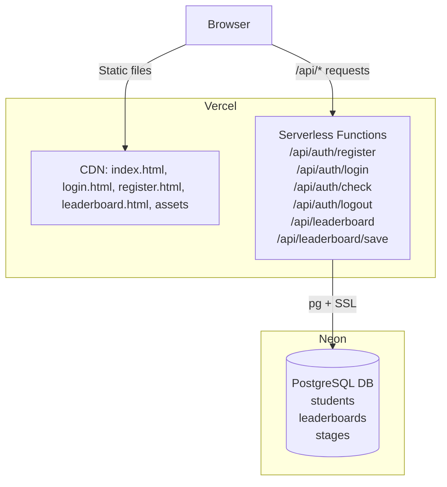

# Design Document: Vercel Deployment

## Overview

This document describes the technical design for migrating "Coding with Cats" from a local PHP/MySQL stack to a fully serverless deployment on Vercel. The migration involves:

- Serving all static assets (HTML, CSS, JS, Phaser game files) via Vercel's CDN
- Replacing PHP auth endpoints with Node.js serverless functions under `/api/auth/`
- Replacing PHP leaderboard endpoints with Node.js serverless functions under `/api/leaderboard/`
- Replacing PHP session-based auth with JWT stored in httpOnly cookies
- Connecting to Neon (cloud PostgreSQL) via the `pg` driver with SSL
- Converting `login.php` and `register.php` to plain HTML + JS fetch pages

The result is a zero-server deployment: Vercel handles static hosting and serverless function execution; Neon handles persistent data.

---

## Architecture



**Request flow for auth:**
1. Browser POSTs credentials to `/api/auth/login`
2. Serverless function validates against DB, signs JWT, sets httpOnly cookie
3. Subsequent requests include the cookie automatically
4. `/api/auth/check` verifies the JWT and returns user info

**Request flow for leaderboard:**
1. Browser GETs `/api/leaderboard?stage=N` — no auth required
2. Browser POSTs to `/api/leaderboard/save` with JWT cookie — auth required

---

## Components and Interfaces

### File Structure

```
/
├── index.html                        # Main game hub (updated fetch calls)
├── login.html                        # New: replaces database/login.php
├── register.html                     # New: replaces database/register.php
├── admin.html                        # New: admin panel (stage mgmt + reports)
├── shop.html                         # New: item shop for students
├── vercel.json                       # Vercel routing config
├── package.json                      # Node deps: pg, jsonwebtoken, bcryptjs, cookie
├── scripts/
│   └── seed-admin.js                 # One-time script: seeds admin account from env vars
├── api/
│   ├── _db.js                        # Shared DB pool helper
│   ├── _auth.js                      # Shared JWT/cookie helpers
│   ├── auth/
│   │   ├── register.js               # POST /api/auth/register
│   │   ├── login.js                  # POST /api/auth/login
│   │   ├── check.js                  # GET  /api/auth/check
│   │   └── logout.js                 # POST /api/auth/logout
│   ├── leaderboard/
│   │   ├── index.js                  # GET  /api/leaderboard?stage=N
│   │   └── save.js                   # POST /api/leaderboard/save
│   ├── admin/
│   │   ├── stages.js                 # GET/POST /api/admin/stages
│   │   ├── stages/[id].js            # PUT/DELETE /api/admin/stages/:id
│   │   └── reports/
│   │       └── progress.js           # GET /api/admin/reports/progress
│   └── shop/
│       ├── items.js                  # GET /api/shop/items
│       └── buy.js                    # POST /api/shop/buy
├── src/
│   ├── world1/ ... world2/ ... world3/   # Game levels (world2/lvl5 and world3/lvl5 added)
│   └── ...
├── assets/                           # Unchanged game assets
├── Quiz-project/
│   └── leaderboard.html              # Updated fetch calls
└── database/
    └── coding_with_cats.sql          # Reference schema (not deployed)
```

### vercel.json

```json
{
  "rewrites": [
    { "source": "/api/(.*)", "destination": "/api/$1" }
  ]
}
```

Vercel automatically routes files in `api/` as serverless functions. Static files are served from the root. No explicit static rewrite is needed.

### Shared DB Helper: `api/_db.js`

```js
// api/_db.js
const { Pool } = require('pg');

let pool;

function getPool() {
  if (!pool) {
    pool = new Pool({ connectionString: process.env.DATABASE_URL, ssl: { rejectUnauthorized: false } });
  }
  return pool;
}

module.exports = { getPool };
```

Connection pooling is module-level so the pool is reused across warm invocations of the same function instance. Neon provides a single `DATABASE_URL` connection string; SSL is handled automatically via that string.

### Shared Auth Helper: `api/_auth.js`

```js
// api/_auth.js
const jwt = require('jsonwebtoken');
const cookie = require('cookie');

const COOKIE_NAME = 'token';
const COOKIE_OPTS = {
  httpOnly: true,
  secure: true,
  sameSite: 'Strict',
  path: '/',
  maxAge: 60 * 60 * 24 * 7, // 7 days
};

function signToken(payload) {
  return jwt.sign(payload, process.env.JWT_SECRET, { expiresIn: '7d' });
}

function verifyToken(req) {
  const cookies = cookie.parse(req.headers.cookie || '');
  const token = cookies[COOKIE_NAME];
  if (!token) return null;
  try {
    return jwt.verify(token, process.env.JWT_SECRET);
  } catch {
    return null;
  }
}

function setCookie(res, token) {
  res.setHeader('Set-Cookie', cookie.serialize(COOKIE_NAME, token, COOKIE_OPTS));
}

function clearCookie(res) {
  res.setHeader('Set-Cookie', cookie.serialize(COOKIE_NAME, '', { ...COOKIE_OPTS, maxAge: 0 }));
}

module.exports = { signToken, verifyToken, setCookie, clearCookie };
```

### API Route Interfaces

#### POST /api/auth/register

- Request body: `{ username: string, email: string, password: string, role?: "User"|"Admin" }`
- Success: HTTP 201 `{ success: true, username }`
- Errors: 400 (validation), 409 (duplicate)

#### POST /api/auth/login

- Request body: `{ username: string, password: string }`
- Success: HTTP 200 `{ success: true, username }` + sets `token` cookie
- Errors: 400 (missing fields), 401 (bad credentials)

#### GET /api/auth/check

- No body; reads `token` cookie
- Success: HTTP 200 `{ authenticated: true, username, student_id }` or `{ authenticated: false }`

#### POST /api/auth/logout

- No body
- Success: HTTP 200 `{ success: true }` + clears `token` cookie

#### GET /api/leaderboard?stage=N

- Query param: `stage` (integer 1–15)
- Success: HTTP 200 `[{ student_id, username, score, stage_id, rank, recordedAt }, ...]`
- Errors: 400 (missing/invalid stage)

#### POST /api/leaderboard/save

- Request body: `{ stage_id: number, base_score: number, completion_time_ms: number }`
- Reads `student_id` from JWT cookie
- Computes `time_bonus = max(0, floor((300000 - completion_time_ms) / 1000))`
- Checks streak: if student's last 2 submissions for this stage both beat their previous best, applies 1.5× multiplier
- Success: HTTP 201 `{ success: true, final_score, rank, bonus_applied }`
- Errors: 400 (validation), 401 (unauthenticated)

#### GET /api/admin/stages

- Requires Admin JWT cookie
- Success: HTTP 200 `[{ stage_id, name, difficulty, description, maxScore, isActive }, ...]`
- Errors: 403 (not admin)

#### POST /api/admin/stages

- Requires Admin JWT cookie
- Request body: `{ name, difficulty, description, maxScore }`
- Success: HTTP 201 `{ stage_id, name, difficulty, description, maxScore, isActive: 1 }`
- Errors: 400 (validation), 403 (not admin)

#### PUT /api/admin/stages/:id

- Requires Admin JWT cookie
- Request body: any subset of `{ name, difficulty, description, maxScore, isActive }`
- Success: HTTP 200 `{ success: true }`
- Errors: 403 (not admin), 404 (stage not found)

#### DELETE /api/admin/stages/:id

- Requires Admin JWT cookie
- Success: HTTP 200 `{ success: true }`
- Errors: 403 (not admin), 404 (stage not found)

#### GET /api/admin/reports/progress

- Requires Admin JWT cookie
- Success: HTTP 200 `[{ student_id, username, totalPoints, completedStages: [{ stage_id, score, completedAt }] }, ...]`
- Errors: 403 (not admin)

#### GET /api/shop/items

- No auth required
- Success: HTTP 200 `[{ item_id, name, type, price, description }, ...]`

#### POST /api/shop/buy

- Requires Student JWT cookie
- Request body: `{ item_id: string }`
- Success: HTTP 200 `{ success: true, remainingPoints }`
- Errors: 401 (unauthenticated), 402 (insufficient points), 404 (item not found)

---

## Data Models

### students table (existing, used as-is)

| Column       | Type         | Notes                        |
|--------------|--------------|------------------------------|
| student_id   | TEXT         | PK, generated with `uuid_generate_v4()`  |
| username     | TEXT         | UNIQUE                       |
| email        | TEXT         | UNIQUE                       |
| password     | TEXT         | bcrypt hash                  |
| role         | TEXT         | 'User' or 'Admin'            |
| totalPoints  | int          | default 0                    |
| createdAt    | timestamp    | default current_timestamp    |
| lastLogin    | timestamp    | nullable                     |

### leaderboards table (existing, extended)

| Column           | Type        | Notes                                      |
|------------------|-------------|--------------------------------------------|
| leaderboard_id   | TEXT        | PK                                         |
| student_id       | TEXT        | FK → students                              |
| stage_id         | TEXT        | FK → stages (stored as int)                |
| base_score       | int         | raw score from game                        |
| time_bonus       | int         | computed: max(0, floor((300000-ms)/1000))  |
| final_score      | int         | base_score + time_bonus (× 1.5 if streak)  |
| completion_time_ms | int       | milliseconds to complete the stage         |
| bonus_applied    | BOOLEAN     | true if streak multiplier was applied      |
| rank             | int         | computed at insert time                    |
| recordedAt       | timestamp   | default current_timestamp                  |

### stages table (existing, seeded manually)

| Column      | Type        | Notes                    |
|-------------|-------------|--------------------------|
| stage_id    | TEXT        | PK (values "1"–"15")     |
| name        | TEXT        |                          |
| difficulty  | TEXT        |                          |
| maxScore    | int         |                          |
| isActive    | BOOLEAN     | default true             |

### JWT Payload

```ts
{
  student_id: string,
  username: string,
  role: string,
  iat: number,
  exp: number
}
```

### Environment Variables

| Variable        | Description                                      |
|-----------------|--------------------------------------------------|
| DATABASE_URL    | Neon PostgreSQL connection string                |
| JWT_SECRET      | Random 256-bit secret for JWT signing            |
| ADMIN_USERNAME  | Fixed admin account username (used by seed script)|
| ADMIN_PASSWORD  | Fixed admin account plaintext password (seed only)|

### Admin Seeding

`scripts/seed-admin.js` is a one-time Node.js script run manually (or as a Vercel deploy hook) that:
1. Reads `ADMIN_USERNAME` and `ADMIN_PASSWORD` from env
2. Hashes the password with bcrypt
3. Upserts a row in `students` with `role = 'Admin'`

The registration endpoint always forces `role = 'User'` regardless of request body, so no client can self-elevate.

---

## Correctness Properties

*A property is a characteristic or behavior that should hold true across all valid executions of a system — essentially, a formal statement about what the system should do. Properties serve as the bridge between human-readable specifications and machine-verifiable correctness guarantees.*

### Property 1: Register → Login Round Trip

*For any* valid username, email, and password, registering a new account and then logging in with the same credentials should succeed (HTTP 200) and return the same username.

**Validates: Requirements 2.2, 3.2**

---

### Property 2: Login → Check Round Trip

*For any* registered user, logging in should set a JWT cookie such that a subsequent `GET /api/auth/check` call returns `{ authenticated: true }` with the correct username and student_id.

**Validates: Requirements 3.2, 4.2**

---

### Property 3: Login → Logout → Check Round Trip

*For any* registered user, logging in and then logging out should result in `GET /api/auth/check` returning `{ authenticated: false }`.

**Validates: Requirements 5.2**

---

### Property 4: Registration Input Validation

*For any* registration request where at least one of the following is true — `username` is empty/missing, `email` is empty/missing, `password` is empty/missing, `password` length is less than 6, or `email` is not a valid email format — the Auth_Service should return HTTP 400.

**Validates: Requirements 2.5, 2.6, 2.7**

---

### Property 5: Leaderboard Shape and Ordering

*For any* valid stage number (1–15) with at least one saved score, the leaderboard response should be an array of at most 10 entries, sorted by score descending, where every entry contains `student_id`, `username`, `score`, `stage_id`, `rank`, and `recordedAt`.

**Validates: Requirements 6.2, 6.3**

---

### Property 6: Leaderboard Stage Validation

*For any* stage value that is not an integer in the range 1–15 (including missing, zero, negative, or greater than 15), `GET /api/leaderboard` should return HTTP 400.

**Validates: Requirements 6.4, 6.5**

---

### Property 7: Save Score → Leaderboard Round Trip

*For any* authenticated user and valid stage/score combination, saving a score and then fetching the leaderboard for that stage should result in the saved score appearing in the returned array.

**Validates: Requirements 7.2**

---

### Property 8: Rank Calculation Correctness

*For any* set of existing scores for a stage and a new score being submitted, the returned rank should equal the count of existing scores strictly greater than the new score, plus one.

**Validates: Requirements 7.3**

---

### Property 9: Missing Environment Variables → HTTP 500

*For any* API route, if a required environment variable (`DATABASE_URL` or `JWT_SECRET`) is absent, the route handler should return HTTP 500 rather than throwing an unhandled error.

**Validates: Requirements 8.4**

---

### Property 10: Admin Role Enforcement

*For any* Admin_Service route (`/api/admin/*`), a request carrying a JWT with `role = 'User'` or no JWT at all should be rejected with HTTP 403.

**Validates: Requirements 11.6, 12.7**

---

### Property 11: Registration Always Assigns User Role

*For any* registration request body — including one that explicitly sets `role = 'Admin'` — the created student record in the DB should always have `role = 'User'`.

**Validates: Requirements 11.4**

---

### Property 12: Shop Purchase Deducts Points Correctly

*For any* student with `totalPoints >= item.price`, purchasing an item should result in `remainingPoints = totalPoints - item.price` and a new row in `student_items`.

**Validates: Requirements 14.5**

---

### Property 13: Insufficient Points Rejected

*For any* student with `totalPoints < item.price`, a purchase attempt should return HTTP 402 and leave `totalPoints` unchanged.

**Validates: Requirements 14.6**

---

### Property 14: Time Bonus Calculation

*For any* `completion_time_ms` value, the computed `time_bonus` should equal `max(0, floor((300000 - completion_time_ms) / 1000))`. Specifically: completions faster than 300 seconds earn a positive bonus; completions at or slower than 300 seconds earn zero bonus.

**Validates: Requirements 7.3**

---

### Property 15: Streak Multiplier Applied Correctly

*For any* student who submits a score that beats their personal best for a stage 3 times in a row, the third submission's `final_score` should equal `floor(base_score + time_bonus) * 1.5` and `bonus_applied` should be `true`. For all other submissions, `bonus_applied` should be `false`.

**Validates: Requirements 7.4**

---

## Error Handling

### API Error Response Shape

All API routes return errors in a consistent JSON shape:

```json
{ "error": "Human-readable message" }
```

HTTP status codes follow REST conventions:
- 400 — client validation error
- 401 — unauthenticated
- 402 — payment required (insufficient points)
- 403 — forbidden (wrong role)
- 404 — resource not found
- 409 — conflict (duplicate resource)
- 500 — server/DB error

### Database Errors

- All DB queries are wrapped in try/catch
- On DB connection failure, routes return HTTP 500 with `{ error: "Database error" }` (no internal details leaked to client)
- Neon connection uses SSL via `DATABASE_URL`; if SSL handshake fails, the function returns 500

### JWT Errors

- Expired tokens: `verifyToken` returns `null`; `check` returns `{ authenticated: false }`
- Tampered tokens: `jwt.verify` throws; caught and returns `null`
- Missing cookie: `verifyToken` returns `null`

### Input Validation

- All user-supplied strings are validated before DB queries (no raw string interpolation)
- `pg` parameterized queries (`$1, $2` placeholders) prevent SQL injection
- bcrypt is used for all password hashing (never store plaintext)

---

## Testing Strategy

### Dual Testing Approach

Both unit tests and property-based tests are required. They are complementary:
- Unit tests catch specific bugs and verify concrete examples
- Property tests verify universal correctness across many generated inputs

### Property-Based Testing

**Library**: [fast-check](https://github.com/dubzzz/fast-check) (JavaScript/Node.js)

Each property test runs a minimum of **100 iterations** with randomly generated inputs.

Each test is tagged with a comment in the format:
`// Feature: vercel-deployment, Property N: <property text>`

Each correctness property (1–9 above) must be implemented as a single property-based test.

**Property test targets:**
- Property 1: Register → Login round trip — generate random valid user data, call register handler, then login handler, assert HTTP 200 and matching username
- Property 2: Login → Check round trip — generate random user, register, login, call check, assert `authenticated: true`
- Property 3: Login → Logout → Check — generate random user, register, login, logout, check, assert `authenticated: false`
- Property 4: Registration validation — generate invalid inputs (empty fields, short passwords, malformed emails), assert HTTP 400
- Property 5: Leaderboard shape — seed random scores for a random stage, fetch leaderboard, assert sort order, max 10, required fields
- Property 6: Leaderboard stage validation — generate out-of-range stage values, assert HTTP 400
- Property 7: Save → Leaderboard round trip — save a score, fetch leaderboard, assert score appears
- Property 8: Rank calculation — generate a set of scores and a new score, save, assert returned rank matches formula
- Property 9: Missing env vars — unset env vars, call any route, assert HTTP 500
- Property 10: Admin role enforcement — generate JWTs with role='User' or no JWT, call any /api/admin/* route, assert HTTP 403
- Property 11: Registration always assigns User role — generate registration bodies including role='Admin', assert stored role is always 'User'
- Property 12: Shop purchase deducts points — generate student with sufficient points, purchase item, assert remainingPoints = totalPoints - price
- Property 13: Insufficient points rejected — generate student with points < item price, attempt purchase, assert HTTP 402 and unchanged totalPoints

### Unit Tests

Unit tests focus on:
- Specific response shape examples (HTTP 201 on register, HTTP 200 on login)
- Error condition examples (HTTP 409 on duplicate, HTTP 401 on bad password, HTTP 401 on missing JWT)
- Edge cases (empty leaderboard returns `[]`, logout without prior login still returns 200)
- `vercel.json` routing configuration correctness

**Test framework**: Jest

### Test File Structure

```
api/
  __tests__/
    auth.register.test.js
    auth.login.test.js
    auth.check.test.js
    auth.logout.test.js
    leaderboard.get.test.js
    leaderboard.save.test.js
    admin.stages.test.js
    admin.reports.test.js
    shop.items.test.js
    shop.buy.test.js
    properties/
      auth.properties.test.js
      leaderboard.properties.test.js
      admin.properties.test.js
      shop.properties.test.js
```

---

## UI and Audio Design

### Game-Like Animations

All pages use CSS animations to create a game feel:

- **Level cards** (`index.html`): `transform: translateY(-8px)` on hover with a `box-shadow` pulse; unlocked cards animate in with a `fadeInUp` keyframe on page load
- **Leaderboard entries**: slide in from the right using a `slideInRight` keyframe when data loads, staggered by index
- **Score reveal** (level completion): a counter animation counts up from 0 to `final_score` over 1.5 seconds
- **Streak banner**: full-screen overlay with a `bounceIn` keyframe, auto-dismisses after 2.5 seconds
- **Auth pages**: existing paw-print stamp animation retained

### Audio

- Background music: a looping `.ogg`/`.mp3` track loaded via `<audio loop>`, started on first user interaction (click/keypress) to comply with browser autoplay policy
- Mute toggle: a 🔊/🔇 button in the header; preference stored in `localStorage` under key `cwc_muted`
- Sound effects: short `.ogg` clips for level-start, victory, and streak bonus, played via the Web Audio API `AudioContext`

### Audio File Structure

```
assets/
  audio/
    bg_music.ogg
    sfx_level_start.ogg
    sfx_victory.ogg
    sfx_streak.ogg
```

